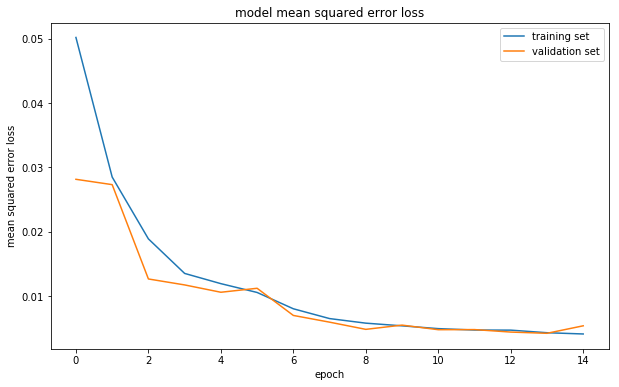
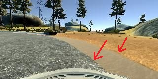
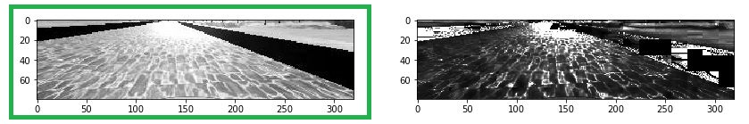
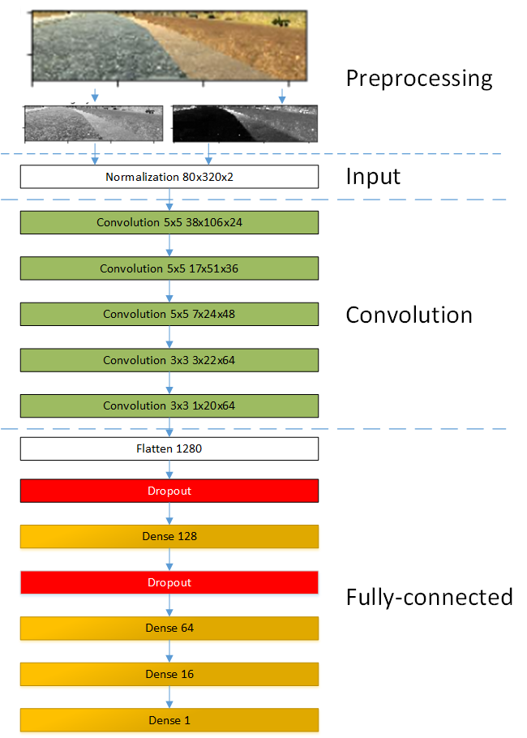

# Behavioral Cloning Project #

The goals / steps of this project are the following:
* Use the simulator to collect data of good driving behavior
* Build, a convolution neural network in Keras that predicts steering angles from images
* Train and validate the model with a training and validation set
* Test that the model successfully drives around track one without leaving the road
* Summarize the results with a written report


[//]: # (Image References)

[image1]: ./examples/placeholder.png "Model Visualization"
[image2]: ./examples/placeholder.png "Grayscaling"
[image3]: ./examples/placeholder_small.png "Recovery Image"
[image4]: ./examples/placeholder_small.png "Recovery Image"
[image5]: ./examples/placeholder_small.png "Recovery Image"
[image6]: ./examples/placeholder_small.png "Normal Image"
[image7]: ./examples/placeholder_small.png "Flipped Image"

### Rubric Points ###
Here I will consider the [rubric points](https://review.udacity.com/#!/rubrics/432/view) individually and describe how I addressed each point in my implementation.

---
### Files Submitted and Code quality ###

#### Files ####

My project includes the following files:
* learn.ipynb containing the Jupyter notebook with the model. The code is the same as in model.py but is easier to read and it contains some image examples
* model.py containing the script to create and train the model
* drive.py for driving the car in autonomous mode
* model.h5 containing a trained convolution neural network
* writeup_report.md or writeup_report.pdf summarizing the results

#### Trained Model and Code ####

Using the Udacity provided simulator and my drive.py file, the car can be driven autonomously around the track by executing
```sh
python drive.py model.h5
```

Here is an example of car driving autonomously one lap in simulator:


## Model Architecture and Training Strategy ##

### Solution Design Approach ###

My first approach was to take the simpliest possible model with a single dense layer to test the tool chain and learn Keras. Once I got it working I replaced it with the "Nvidia" architecture presented in chapter 14 "Even More Powerful Network".

My model consists of a convolution neural network with 5 layers having kernel sizes 5x5 and 3x3 and depths between 24 and 64 (model.py lines 145-163). Five convolution layers are followed by three fully-connected layers that finally produce a single float value of desired steering angle.
First two fully connected layers have linear exponential activation (ELU).

### Reducing overfitting ###

To reduce overfitting I did two things:

#### Gather more data ####

Every image is flipped horizontaly, which effectively produces another training map were car drives in opposite direction.  

Source:


Derived image:


I also used images from side cameras adding correction value +-0.25 to the measured steering angle.

Center camera: use the recorded angle.


Left camera image: if the center camera will see this, we need to steer to the right. Add +0.25 to the measured angle.


Right camera image: if the center camera will see this, we need to steer to the left. Add -0.25 to the measured angle.


#### Dropout ####

The model contains two dropout layers between fully-connected ones, which should also help with the regularisation.

#### Check that model does not overfitt ### 

I shuffled samples and splitted them in training and validation datasets (80%/20%) to ensure that the model was not overfitting (code line 103). 

The model was tested by running it through the simulator and ensuring that the vehicle could stay on the track.

#### Validation loss ####



Here there is no sign of overfiiting when the training loss keeps decreasing, while the validation loss gets stuck on constant level.

### Model parameter tuning ###

The model used an adam optimizer, which has default learning rate of 0.001. When using dropout layers it's recomended to use smaller learning rate, so I reduced it to 0.0005 (code line 178).

### Training data ###

To gather enough training data I recorded the following scenarios:

1. Drive three laps counter clockwise keeping the car in the middle of the road.
2. Drive three laps clockwise keeping the car in the middle of the road
3. Drive four recovery laps where I intentionally steered the car to the side and then returned it to the road. To learn only the good behavior (returning back) in these records I use only samples with positive or only negative steering angles.
4. Drive carefully through the curves. In this records I only import samples with non zero steering angle.

Here is an example of good behavior that model should learn:


And here I show how to recover from the trouble by steering 15 degrees right:


The import and filtering is handled in the function "importCsv".

```python
samples = np.append(samples, importCsv('ccw'))
samples = np.append(samples, importCsv('cw'))

samples = np.append(samples, importCsv('curves-ccw', curvesOnly=True))
samples = np.append(samples, importCsv('curves-2', curvesOnly=True))
samples = np.append(samples, importCsv('curves-3', curvesOnly=True))

samples = np.append(samples, importCsv('recovery-minus', negativeOnly=True))
samples = np.append(samples, importCsv('recovery-plus', positiveOnly=True))
samples = np.append(samples, importCsv('recovery-minus-2', negativeOnly=True))
samples = np.append(samples, importCsv('recovery-plus-2', positiveOnly=True))
```   

These four scenarios with images from the center, left and right cameras and flipping every image provided me totally 79554 samples.  

### Preprocessing ###

First experiments with the model showed that the network can be distracted by sun reflections, shadows on the road and completely fails to detect the border between the road and sand. RGB images have very low contrast here:



I tried different color spaces and finally decided to use two channels instead of original RGB:

1. Green channel of the RGB color space that is good for detection of yellow/red lines and bridge sides. First I tried to take the gray channel, but green produces more contrast on white/red stripes.
2. S channel of the HLS color space. It is good for detection of road/sand border but completely fails on bridge bars.

These two channels combined provide clear road border in all combination of ground and lighting conditions.

Bridge, here the G channel provides the best results.


Sand, here the S channel performs better.


At the end all images were cropped to 320x80 pixels by cutting top 60 and bottom 20 rows. 
 
  

### Driving in simulator ###

The same color correction and cropping were applied to images in the drive.py file (code line 73).
 
### Data feed ###

I recorded more than 700 Megabytes of sample images. To save the memory I used python generators to feed the model with batches each having 32 samples. 


### Final Model Architecture ###

  

## Results ##

At the end of the process, the vehicle is able to drive autonomously around the track without leaving the road.

The autonomous driving is recorded in video "video.mp4" 

